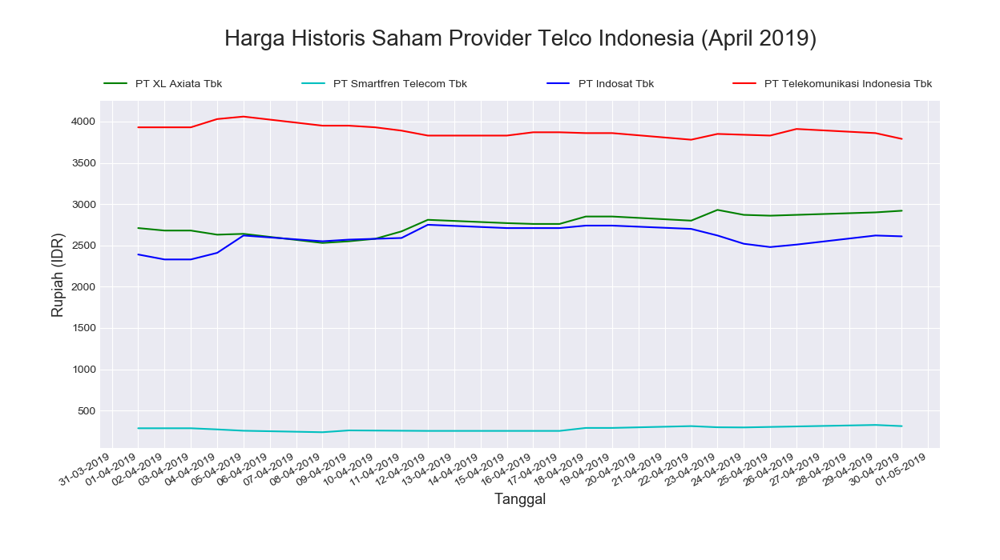

# Soal Ujian Data Science - Analytics & Visualization

#

### **Soal 3 - Harga Historis Saham Provider Telco Indonesia**

Disediakan 4 buah file __.csv__ yang berisi harga historis saham harian selama 3 bulan terakhir (18/Mar/2019 - 14/Jun/2019) dari 4 perusahaan provider telekomunikasi ternama di Indonesia. Unduh file .csv dari repo ini atau [klik sini](./dataSaham):

Nama Provider|Unduh csv
-----|-----
PT. XL Axiata Tbk|[EXCL.JK.csv](./dataSaham/EXCL.JK.csv)
PT Smartfren Telecom Tbk|[FREN.JK.csv](./dataSaham/FREN.JK.csv)
PT Indosat Tbk|[ISAT.JK.csv](./dataSaham/ISAT.JK.csv)
PT Telekomunikasi Indonesia Tbk|[TLKM.JK.csv](./dataSaham/TLKM.JK.csv)

#

1. Buatlah sebuah file __python__ yang mengakses data dari ke-4 file .csv tersebut, kemudian tampilkan data plot harga penutupan (close) harian seluruh data yang ada. Output yang diharapkan berupa __grafik garis__ yang menampilkan harga penutupan (close) harian dari ke-4 perusahaan telco selama 3 bulan terakhir:

    

#

2. Buatlah sebuah file __python__ yang mengakses data dari ke-4 file .csv tersebut, kemudian tampilkan data plot harga penutupan (close) harian selama __bulan April 2019__. Output yang diharapkan berupa __grafik garis__ yang menampilkan harga penutupan (close) harian dari ke-4 perusahaan telco selama __bulan April 2019__:

    

    ✅ *Commit & push source code jawaban soal ini ke __Github__ Anda, buatlah repo dengan nama __Saham_Telco_IDN__, kemudian lampirkan __url link repo Github__ Anda via email ke _lintang@purwadhika.com!_*

#

### *__#HappyCoding__* :relaxed:

#### Lintang Wisesa :love_letter: _lintangwisesa@ymail.com_

[Facebook](https://www.facebook.com/lintangbagus) | 
[Twitter](https://twitter.com/Lintang_Wisesa) |
[Google+](https://plus.google.com/u/0/+LintangWisesa1) |
[Youtube](https://www.youtube.com/user/lintangbagus) | 
:octocat: [GitHub](https://github.com/LintangWisesa) |
[Hackster](https://www.hackster.io/lintangwisesa)# Saham_Telco_IDN
